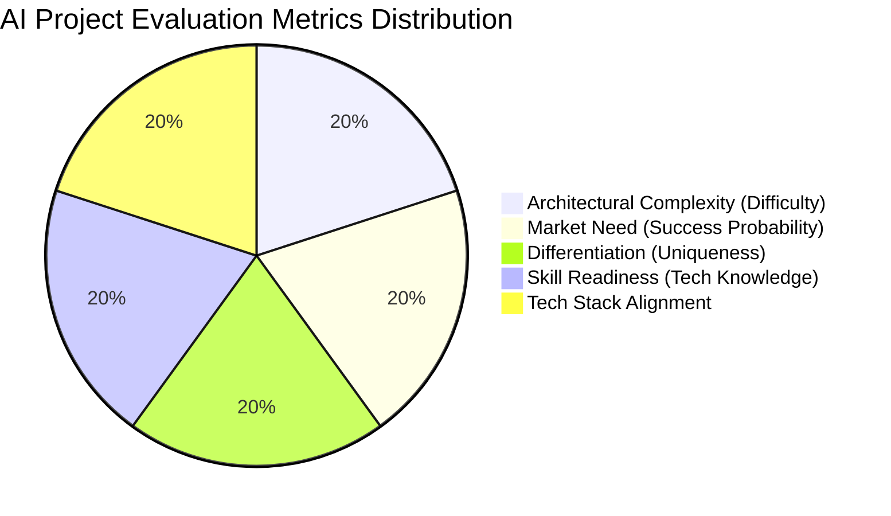
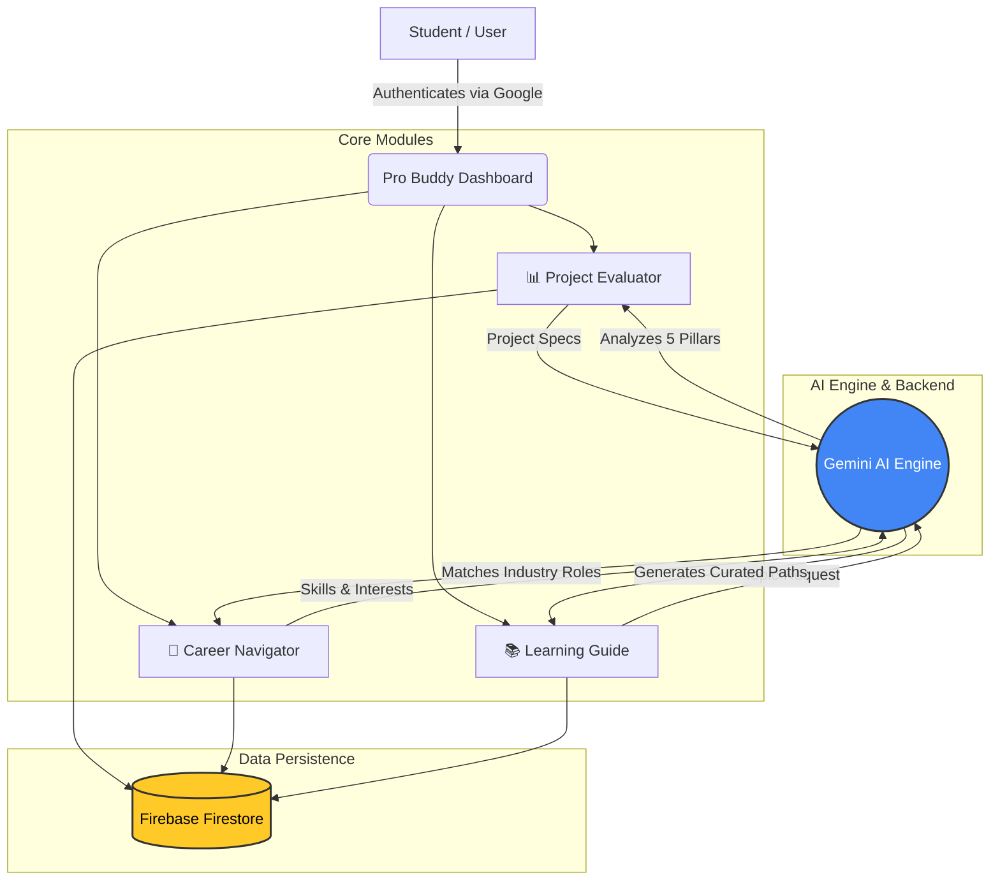
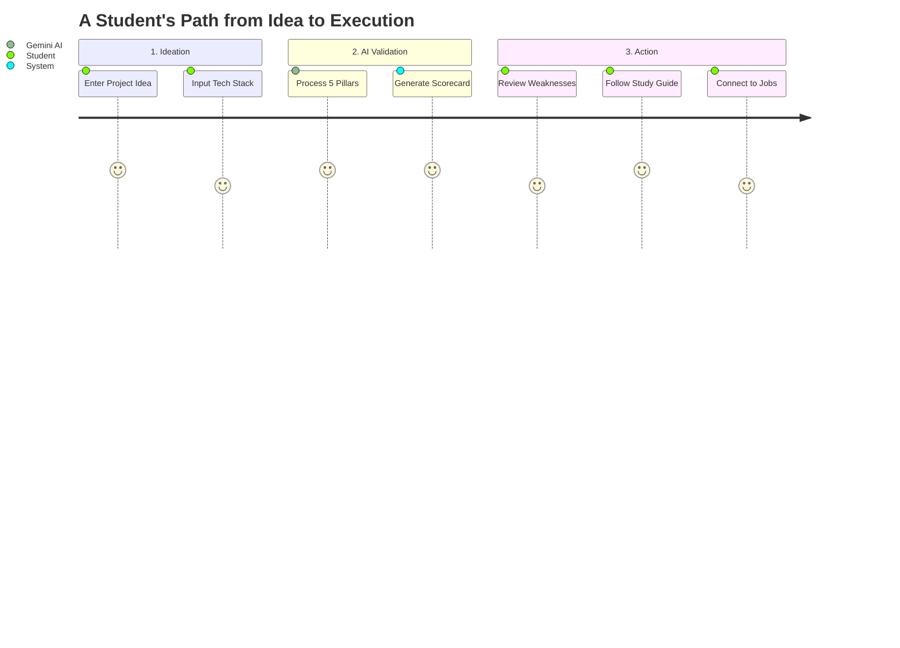

  
  <h1>🚀 Pro Buddy</h1>
  <h3>From Confusion to Execution</h3>
  
<i>A Smart India Hackathon (SIH) Submission</i>

  
  

  
  
  
  
  

---

## 📌 Problem Statement & Solution

<table style="width:100%">
<tr>
<td width="50%" valign="top">
<h3>❌ The Execution Gap</h3>
Students and early-career professionals often have innovative ideas but lack the structured methodology to validate them. Navigating career paths and finding the right study resources in an ocean of information leads to confusion, wasted time, and abandoned projects.
</td>
<td width="50%" valign="top">
<h3>✅ Our Solution: Pro Buddy</h3>
An AI-powered multidimensional platform that evaluates project ideas, navigates career paths, and curates high-quality study resources. It transforms raw ideas into quantified, actionable technical blueprints, helping students build with certainty.
</td>
</tr>
</table>

### 📊 The 5-Pillar Evaluation Infographic

---

## 🏗️ Platform Architecture Flowchart

---

## 🗺️ The Student Journey (Timeline)

---

## 🌟 Key Features (Visual Breakdown)

###  1. Project Evaluator (AI Validation)

Before writing a single line of code, students submit their project idea, target audience, and tech stack. Our Gemini-powered engine benchmarks the idea across 5 core pillars.
  
<i>Output:</i> Concrete metric scorecards, known existing solutions, strengths/weaknesses, and an actionable execution blueprint.

 

###  2. Career Navigator

Students input their current skills and interests. Pro Buddy maps these to real-world industry roles (e.g., SDE, Data Engineer, Product Manager), complete with salary expectations, required skill gaps, and direct links to live opportunities on LinkedIn.

 

###  3. Learning Guide

A structured curriculum generator. Instead of endless scrolling, users get instantly curated, high-quality study resources (YouTube playlists, documentation, and roadmaps) tailored to specific technical topics (e.g., System Design, DSA, Web3).

 

---

## ⚙️ Technology Stack

| Tier | Component | Technology | Why we chose this? |
| :---: | :--- | :--- | :--- |
| 🎨 | **Frontend** | React.js, Vite, Tailwind | Fast rendering, component-based UI, and rapid styling. |
| 🖥️ | **Backend** | Node.js, Express.js | Non-blocking I/O, perfect for proxying AI requests securely. |
| 🗄️ | **Database** | Firebase Firestore | NoSQL structure, real-time updates, highly scalable. |
| 🔐 | **Auth** | Firebase Authentication | Secure, frictionless Google Sign-In integration. |
| 🧠 | **AI Engine** | Google Gemini (3.1 Pro) | High-speed, highly accurate reasoning and structured JSON outputs. |

---

## 🏆 For SIH Judges: Why This Wins?

> **1. Feasibility:** Built on highly scalable serverless infrastructure (Firebase + Cloud Run).  
> **2. Impact:** Directly addresses the employability and skill-gap crisis in Indian engineering education.  
> **3. Innovation:** Moves beyond generic chatbots by providing *structured, quantified metric scorecards* for raw ideas.  
> **4. Execution:** Clean UI/UX, robust error handling, and offline/online state persistence.

 

  
  
<i>Built with ❤️ for the Smart India Hackathon</i>

