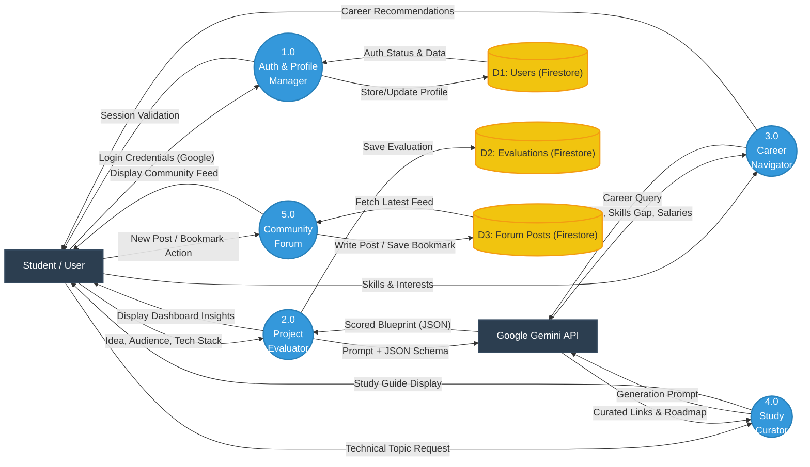

# Pro Buddy - Data Flow Diagram (DFD)

This document contains the Level 1 Data Flow Diagram (DFD) for the **Pro Buddy** platform. It illustrates how data moves through the system between external entities, core processes, and databases.

## Methodology & Process for Implementation

You can use the diagram below in your presentations or documentation to explain the system architecture.

## Components Breakdown

### 1. External Entities (Dark Rectangles)
* **Student / User:** The primary actor providing inputs (ideas, skills) and receiving outputs (evaluations, roadmaps).
* **Google Gemini API:** The external intelligence engine that processes text prompts and returns structured JSON analysis.

### 2. Core Processes (Blue Circles)
* **1.0 Auth & Profile Manager:** Handles Google Sign-In and session state tracking.
* **2.0 Project Evaluator:** The core AI loop that scores project viability.
* **3.0 Career Navigator:** Matches skills to industry roles.
* **4.0 Study Curator:** Generates focused technical learning roadmaps.
* **5.0 Community Forum:** Manages peer-to-peer knowledge sharing and bookmarks.

### 3. Data Stores (Yellow Cylinders)
* **D1: Users:** Stores basic profile info and authentication UID.
* **D2: Evaluations:** Persists the historical AI evaluations so they show up on the user's dashboard.
* **D3: Forum Posts:** Stores the community feed, tags, and bookmark references.
